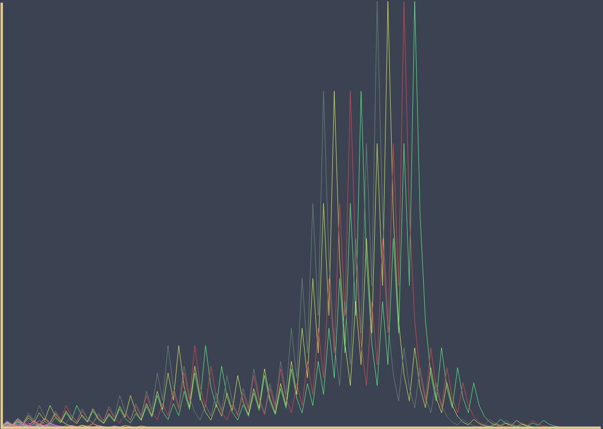

# Collatz Conjecture Visualization - Graph

​Customizable visualization of the Collatz conjecture in JavaScript.
Running live on the web at: https://lelserslasers.itch.io/collatz-conjecture
Uses a graph with iterations on the X and and number on the Y axis.
So if you started at 6: (0, 6) -> (1, 3) -> (2, 10) -> ... -> (7, 2) -> (8, 1)

