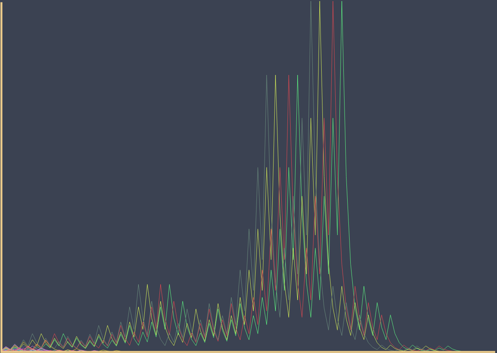

# Collatz Conjecture Visualizations

​Customizable visualizations of the Collatz conjecture in JavaScript.
Running live on the web at:
- https://lelserslasers.itch.io/collatz-conjecture (graph visualization)
- https://lelserslasers.itch.io/collatz-conjecture-2 (tree visualization)

## Graph

## Tree

## What is the Collatz conjecture?

The Collatz conjecture, also known as the 3n+1 conjecture or the hailstone sequence, is an unsolved mathematical problem. It was first proposed by German mathematician Lothar Collatz in 1937. The conjecture is defined as follows:

Start with any positive integer n. If n is even, divide it by 2 to get n/2. If n is odd, multiply it by 3 and add 1 to get 3n+1. Repeat the process with the resulting number, and continue iterating in the same way.

The conjecture states that no matter what positive integer you start with, this process will eventually reach the number 1. Once you reach 1, the sequence will enter a loop that repeats indefinitely: 1, 4, 2, 1, 4, 2, 1, and so on.

For example, let's take the starting number 6. The sequence will be: 6, 3, 10, 5, 16, 8, 4, 2, 1. In this case, it took eight steps to reach 1. However, the conjecture claims that for any positive integer, this sequence will eventually reach 1, even though the number of steps it takes may vary.

Despite its simplicity, the Collatz conjecture remains an unsolved problem in mathematics. No counterexamples have been found, meaning that all numbers tested so far eventually reach 1. However, no general proof has been established to show that this is true for all positive integers and the conjecture continues to be an active area of research.